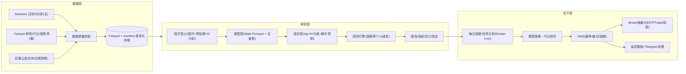

# A股多因子概率决策系统 · 生产级应用设计说明书（v2.0）

> 基于《精简可执行版》方案与顶级策略师评估意见（20% 年化 + 5% 回撤不可兼得，采用
> 版本 C「防御核心 + 进取卫星」目标：年化 12-16%、最大回撤 6-8%）细化而成的
> **个人可落地、可审计、可回放、可扩展**的生产级应用设计。

---

## 1. 目标与验收基准

### 1.1 策略目标（终审重标定）

原「版本 C」目标（年化 12-16%、回撤 6-8%、IR 1.2）经长窗口实证不可达，已按
[FINAL_VERDICT.md](FINAL_VERDICT.md) 重标定如下：

| 指标 | 原目标 | 重标定目标 |
| :--- | :--- | :--- |
| 年化收益 | 12-16% | ≥10%（偏差修正后） |
| 最大回撤 | ≤6-8% | ≤12% |
| Sharpe | ≥1.5 | ≥1.5 |
| Calmar | ≥1.3 | ≥1.0 |
| 月度正收益概率 | ≥65% | ≥65% |
| 信息比率（vs 中证800） | ≥1.2 | ≥0.7 |
| 年化换手（单边） | ≤40%/月 | ≤2x/年 |
| 信号质量 | 模型 AUC≥0.55 | 复合因子 t≥5 |

### 1.2 非功能需求

- **可复现**：同一数据快照 + 同一配置 + 同一随机种子 → 完全一致的结果；
- **可审计**：每次运行保留配置快照、数据指纹、日志、产物 lineage；
- **防过拟合**：所有结论只以 Walk-Forward 样本外结果为准，参数搜索需打折；
- **合规**：数据只取合法公开来源；自动化交易按《证券市场程序化交易管理规定》向券商报告；
- **低运维**：个人维护，单机可跑，数据增量更新全自动，告警可推送。

---

## 2. 参考开源项目与借鉴点

| 项目 | 仓库 | 借鉴点 |
| :--- | :--- | :--- |
| Microsoft Qlib | [microsoft/qlib](https://github.com/microsoft/qlib) | AI 量化全流程（数据→因子→模型→回测→组合）；Alpha158 因子体系；qrun 工作流配置化；数据健康检查脚本 |
| A 股低频研究台 | [cyecho-io/ashare-lowfreq-research](https://github.com/cyecho-io/ashare-lowfreq-research) | 与本文案高度同构：Parquet 存储、workspace 隔离、分数回测、walk-forward、模拟执行、本地 Web 控制台；配置快照与 lineage 可追溯 |
| VeighNa (vnpy) | [vnpy/vnpy](https://github.com/vnpy/vnpy) | 事件驱动引擎、Gateway 交易接口抽象、数据库适配层、风控模块（risk_manager）、组合策略与算法交易模块的架构分层 |
| EasyXT / miniQMT | [quant-king299/EasyXT](https://github.com/quant-king299/EasyXT) | miniQMT(xtquant) 二次封装：统一数据/交易 API、多数据源自动降级（QMT→Tushare→DuckDB→东财→akshare）、DuckDB 存储、增量下载 |
| Hikyuu | [fasiondog/hikyuu](https://github.com/fasiondog/hikyuu) | C++/Python 高性能回测、深度适配 A 股数据体系（复权/涨跌停/停牌） |
| zvt | [zvtvz/zvt](https://github.com/zvtvz/zvt) | 可扩展数据 recorder + 统一查询 API + 增量更新；实体/事件建模 |
| Freqtrade | [freqtrade/freqtrade](https://github.com/freqtrade/freqtrade) | 生产级机器人实践：dry-run 纸面模式、Telegram 告警、Docker 部署、策略回测 + 超参搜索、日志与状态机 |
| Alphalens-reloaded | [stefan-jansen/alphalens-reloaded](https://github.com/stefan-jansen/alphalens-reloaded) | 因子绩效分析：Rank IC、分层收益、换手、衰减；因子上线前的标准体检 |
| 中国 Quant 资源索引 | [thuquant/awesome-quant](https://github.com/thuquant/awesome-quant) | 数据源/回测/交易 API 的合规与可用性对照表 |

**设计取舍**：不直接依赖 Qlib/vnpy 全量框架，而是借鉴其分层思想，自建轻量 pipeline。
原因：① 月频多因子场景不需要事件引擎的复杂度；② 自建代码可审计、可测试、零中间件；
③ 交易执行（QMT/PTrade）按券商渠道单独抽象，避免被框架绑定。

---

## 3. 总体架构



**数据流（每日）**：盘后增量同步 → 质量校验 → 因子计算 → 模型推理 → 生成调仓信号
→（纸面/实盘）OMS 执行 → 对账与监控。

---

## 4. 技术栈

| 层 | 选型 | 说明 |
| :--- | :--- | :--- |
| 语言/运行时 | Python 3.11+（当前 3.12） | 单机，无中间件 |
| 数据计算 | pandas + numpy + pyarrow | 日频数据量小，pandas 足够 |
| 存储 | Parquet + manifest.json | 列式、快、可版本化；可选 DuckDB 做查询加速 |
| 因子分析 | 自研 IC/ICIR + 可选 alphalens-reloaded | 输出表格化报告 |
| 模型 | LightGBM（首选）/ sklearn GBDT（兜底） | 分类目标：未来20日跑赢基准 |
| 配置 | PyYAML + dataclass 校验 | 每份配置可哈希，随产物存档 |
| 报告 | HTML（自包含）+ matplotlib（可选） | 便于浏览器查看与归档 |
| 测试 | pytest | 数据/因子/回测/流水线四级测试 |
| 执行 | miniQMT(xtquant) / PTrade / PaperBroker | 渠道抽象，券商开通后接入 |
| 调度 | Windows 任务计划程序 / Docker cron | 盘后任务 + 盘前信号 |
| 监控 | Streamlit（可选）+ Telegram 推送 | 看板 + 告警 |

---

## 5. 数据层设计

### 5.1 数据源分级

| 数据 | 主源 | 备源 | 说明 |
| :--- | :--- | :--- | :--- |
| 日线 OHLCV | baostock（免费） | Tushare / akshare | baostock 覆盖 1990 至今、含复权因子，接口稳定 |
| 5 分钟线 | baostock（免费） | Tushare（2000积分） | 仅用于入场时机优化，不进信号生成 |
| 财务/估值 | Tushare（120 积分起） | akshare | PE/PB、ROE、股息率 |
| 行业分类 | Tushare 申万行业 / akshare | Qlib 社区数据 | 申万二级，季度更新 |
| 涨跌停/停复牌 | Tushare（5000分）或自算 | akshare | 回测撮合必需；自算规则可兜底 |
| 公告文本 | 巨潮资讯（合法公开） | 东财公告 API | 情绪因子输入，禁爬雪球/股吧 |
| 基准指数 | baostock sh.000906（中证800） | sh.000300 | 超额收益基准 |

### 5.2 数据模型（Parquet schema）

**prices.parquet**（日线，长表）

| 字段 | 类型 | 说明 |
| :--- | :--- | :--- |
| date | date | 交易日 |
| symbol | string | 股票代码，如 `600519.SH` |
| open/high/low/close | float64 | 前复权价 |
| volume | float64 | 成交量（手） |
| amount | float64 | 成交额（元） |
| turnover | float64 | 换手率（%） |
| pe/pb | float64 | 估值（可空） |
| is_limit_up / is_limit_down | bool | 当日是否涨/跌停 |
| is_suspended | bool | 是否停牌（无行情） |
| is_st | bool | 是否 ST |
| adj_factor | float64 | 复权因子 |

**meta.parquet**：symbol、name、list_date、delist_date（**退市股票必须保留**，防幸存者偏差）。

**industry.parquet**：symbol、sw_industry_l2（申万二级）、as_of_date（行业归属以季度为准）。

**fundamentals.parquet**：symbol、ann_date、roe、div_yield、pe_ttm、pb。

**benchmark.parquet**：date、close（中证800）。

### 5.3 存储与版本

```
data/
  raw/          # 原始导入，禁止改写
  processed/    # 清洗后主数据集（prices/meta/industry/fundamentals/benchmark）
  manifest.json # 每个 symbol 的日期范围、行数、更新时间、数据指纹(sha256)
```

- 写入策略：`processed/` 按 symbol 分区增量写入；每次同步后更新 manifest；
- **数据指纹**：对 prices 全表计算 sha256 摘要，存入 manifest 与模型元数据，
  保证"哪份数据训练出的模型"可精确追溯；
- 复权：统一使用**前复权价**做因子与回测；回测撮合价用未复权价核对涨跌停阈值。

### 5.4 增量更新与质量校验

每日盘后任务：拉取最近 5 个交易日 → 校验 → 合并入 processed → 更新 manifest。

**质量校验清单（关键项）**：

| 检查项 | 规则 | 失败处理 |
| :--- | :--- | :--- |
| 缺失日期 | 每个 symbol 交易日历连续，停牌日显式标记 | 记录并告警 |
| OHLC 自洽 | high ≥ max(open, close) ≥ low；high ≥ low | 拒绝该段数据 |
| 价格合理性 | close > 0；单日涨跌幅 ≤ ±30%（除权除外） | 复核复权因子 |
| 成交量 | volume ≥ 0，amount = volume×vwap 近似 | 拒绝 |
| 重复/乱序 | (date, symbol) 唯一 | 去重 |
| 涨跌停一致性 | is_limit_up 与 price ≥ prev_close×1.098（ST 1.05）一致 | 以价格计算为准 |
| 幸存者偏差 | meta.delist_date 非空股票仍保留历史 | 缺失则告警 |

---

## 6. 因子层设计

### 6.1 因子规格（10 个，进攻 6 + 防御 4）

| # | 因子 | 类型 | 方向 | 计算定义 |
| :--- | :--- | :--- | :--- | :--- |
| 1 | mom_12_1 | 进攻/动量 | + | `P(t-21)/P(t-252) - 1`（12-1月动量） |
| 2 | rev_5 | 进攻/反转 | + | `-(P(t)/P(t-5) - 1)`（5日反转，取负后高为好） |
| 3 | vol_ratio | 进攻/量能 | + | `log(MA5(volume)/MA120(volume))` |
| 4 | sentiment | 进攻/情绪 | + | 巨潮公告 FinBERT 得分 7 日滑动均值（无数据取 0.5） |
| 5 | industry_mom | 进攻/板块 | + | 所属申万二级行业 20 日收益率（行业中位数） |
| 6 | valuation | 进攻/估值 | - | 行业内 PE/PB 历史分位均值（越低越好） |
| 7 | low_vol | 防御/波动 | - | 20 日已实现波动率（低波动异象） |
| 8 | div_yield | 防御/股息 | + | 股息率（TTM） |
| 9 | quality | 防御/质量 | + | ROE 及其稳定性（滚动 8 期均值/标准差） |
| 10 | crowding | 防御/拥挤 | - | 60 日换手率均值截面 z-score（拥挤度反向） |

### 6.2 预处理流水线

每个因子按交易日横截面执行：

1. **去极值**：5%/95% winsorize；
2. **缺失处理**：横截面中位数填充（因子缺失率 >40% 的日期剔除）；
3. **标准化**：横截面 z-score；
4. **中性化**：可选行业中性化（对申万二级哑变量回归取残差），默认开启，消除行业暴露。

### 6.3 IC 分析与因子准入/退出

分析对象：因子值与未来 20 日超额收益（相对中证800）。

- **Rank IC**：每日 Spearman 相关系数；输出 IC 均值、ICIR（IC均值/IC标准差）、t 值；
- **分层收益**：按因子 5 分位分组，看多空价差单调性；
- **衰减曲线**：未来 5/10/20/40 日 IC 衰减，确认预测时效；
- **换手**：分位组合月均换手，评估实现成本。

**准入规则**：样本外 Rank IC ≥0.03 且 ICIR ≥0.3 且方向稳定（近 12 个月符号一致率 ≥70%）。
**退出规则**：滚动 12 个月 IC <0.02 或 ICIR <0.2，降权观察；连续 6 个月不恢复则下线。

---

## 7. 模型层设计

### 7.1 标签定义

- 目标：未来 20 个交易日相对中证800 的**超额收益是否为正**（二分类，胜率导向）；
- 备选：Top-30% 分位标签（当月截面），两者都实现，配置切换；
- 仅用 `date < 标签截止日 - 20` 的已实现数据构造样本，杜绝前视。

### 7.2 特征集

- 10 个因子（预处理后）；
- HMM 三状态概率（市场状态，作为 regime 特征，非独立信号）；
- 可选：基准指数动量、波动率分位、行业强弱；
- 特征均按日期对齐，`date` 为唯一时点标识。

### 7.3 Walk-Forward 协议

```
训练窗(3年) → 测试窗(6个月)，滚动 5 折
约束：训练集日期严格 < 测试集日期；特征仅用当日及之前信息
输出：全部 OOS 预测拼接（scores.parquet）
```

- 早停：训练集末段 10% 作为验证集，监控 AUC 早停；
- 超参：固定默认参数跑通基线；网格搜索 >20 组时结论按 Deflated Sharpe 打折；
- 集成：LightGBM 主模型 + GBDT 备用，样本外择优，不做多模型堆叠。

### 7.4 模型注册与版本

每个运行生成 `run_id = 时间戳 + 配置哈希`，产物：

```
artifacts/models/{run_id}/
  model.joblib            # 训练好的模型
  oos_scores.parquet      # 样本外打分
  oos_metrics.json        # AUC/IC/ICIR/分层收益
  feature_importance.csv
  meta.json               # 数据指纹、特征列表、训练区间、参数、种子
```

**上线门槛**：OOS AUC ≥0.55 且 OOS Rank IC ≥0.03；不达标不上线。

---

## 8. 组合与风控层设计

### 8.1 组合构建

- 排序：模型概率降序，取 top-N（默认 30）；
- 权重：等权，单票 ≤5%，单一申万一级行业 ≤25%；
- 股票池：中证800/1000 成分，剔除 ST、上市 <60 日、日均成交额 <5000 万、停牌 >5 日；
- 换手控制：旧持仓概率乘以 0.8 粘性系数参与排序；单期替换数 ≤40%×N。

### 8.2 市场状态机（仓位总闸）

基准：中证800。

| 状态 | 条件 | 目标仓位 |
| :--- | :--- | :--- |
| 进攻 | MA20 > MA120 且 收盘 > MA250 | 100% |
| 中性 | MA20 < MA120 但 收盘 > MA250 | 50% |
| 防御 | 收盘 < MA250 | 0-30%（现金/逆回购） |

### 8.3 波动率目标

- 组合目标年化波动 10%（进取版 12%）；
- 每日按过去 20 日已实现波动调整：`总仓位 ×= min(1, 目标波动/已实现波动)`，下限 20%。

### 8.4 个股风控

- -12% 止损（跌停无法卖出则次日顺延，最多 5 个交易日）；
- 持仓跌出概率前 50% 分位即调出；
- ST 化 / 立案调查 / 退市风险 → 次日无条件清仓；
- 持仓数量 >2N 视为组合失控，触发熔断停用信号。

### 8.5 对冲层（可选，资金门槛）

- 资金 ≥50 万：防御状态启用 IC 空头对冲 0.3-0.5 beta；IC 年化贴水 3-5% 计入成本；
- 期权：300ETF 认沽保险，仅当 IV<20% 时买入下季合约；
- 打新增强：开通科创/创业板权限后市值配售，+1-3%/年。

---

## 9. 回测引擎设计

### 9.1 撮合规则

| 场景 | 规则 |
| :--- | :--- |
| 常规 | 调仓信号基于 T 日收盘数据，**T+1 开盘价成交** |
| 滑点 | 成交价 = 开盘价 × (1 ± slippage_bp/10000) |
| 涨停 | 开盘涨停（open ≥ prev_close×1.098，ST 1.05）→ 买单跳过 |
| 跌停 | 开盘跌停（open ≤ prev_close×0.902）→ 卖单顺延，最多 5 日 |
| 停牌 | 当日无行情 → 订单顺延至复牌日 |
| T+1 | 当日买入不可卖出（本系统月度调仓天然满足，仍显式校验） |
| 拆单 | 单票买卖按整手（100 股）取整 |

### 9.2 成本模型

```
买入成本 = 金额 × (佣金 2.5bp + 过户费 0.1bp + 滑点 5bp) + max(佣金, 5元)
卖出成本 = 金额 × (佣金 2.5bp + 印花税 5bp + 过户费 0.1bp + 滑点 5bp) + max(佣金, 5元)
```

双边总成本约 0.25%，与业界保守口径一致；换手 40%/月 → 年化成本约 0.6-1.2%。

### 9.3 回测输出

- `equity.parquet`：date、portfolio_value、benchmark_value、cash、position_count；
- `trades.parquet`：rebalance_date、symbol、side、shares、price、cost、status（filled/skipped/postponed/dropped）；
- `monthly.parquet`：月度收益、换手、成本；
- `metrics.json`：年化收益、波动、Sharpe、最大回撤、Calmar、月度胜率、个股命中率、alpha/beta/IR、成本拖累。

### 9.4 压力测试场景

| 场景 | 区间 | 验收 |
| :--- | :--- | :--- |
| 2015 股灾 | 2015-06-15 ~ 2015-09-30 | 回撤 ≤ 目标+3% |
| 2018 熊市 | 2018-01-01 ~ 2018-12-31 | 回撤 ≤ 目标+3% |
| 小盘踩踏 | 2024-01-01 ~ 2024-02-29 | 回撤 ≤ 目标+3% |
| 急涨急跌 | 2024-09-24 ~ 2025-02-28 | 回撤 ≤ 目标+3% |

---

## 10. 执行层设计

### 10.1 交易通道对比

| 通道 | 模式 | 门槛/成本 | 稳定性 | 结论 |
| :--- | :--- | :--- | :--- | :--- |
| miniQMT(xtquant) | 本地直连下单 | 券商开通，资金门槛各家 2-50 万不等 | 高，官方 Python API | **首选**（行情+交易+本地部署） |
| PTrade | 策略跑券商端 | 券商开通 | 高 | 备选，脚本语言受限 |
| easytrader | 模拟点击客户端 | 无门槛 | 低，客户端改版即失效 | 不推荐生产 |

### 10.2 Broker 抽象与 OMS

```python
class Broker(Protocol):
    def connect(self) -> None: ...
    def get_cash(self) -> float: ...
    def get_positions(self) -> dict[str, Position]: ...
    def place_order(self, order: Order) -> str: ...
    def cancel_order(self, order_id: str) -> None: ...
    def get_orders(self) -> list[Order]: ...
```

- `PaperBroker`：本地仿真，用于 dry-run 与回放；
- `QMTBroker`：懒加载 xtquant，映射到 xttrader 下单/查询，未安装时给出明确指引；
- OMS 三原则：**幂等**（同一 intent 哈希只下一单）、**重试有上限**（3 次，指数退避）、
  **熔断开关**（连续 3 次异常 → 停止下单并告警）。

### 10.3 上线前检查清单

- [ ] 数据质量连续 30 日通过
- [ ] 纸面交易（PaperBroker）与回测偏差 <20%（换手、成本、成交率）
- [ ] 券商程序化交易报告已提交
- [ ] 小资金（10-20 万）实盘运行 ≥6 个月，月度正收益概率 ≥60%
- [ ] 熔断、止损、顺延逻辑在模拟盘实测通过

---

## 11. 监控与运维

### 11.1 每日运行计划

| 时间 | 任务 |
| :--- | :--- |
| 18:30 | 增量数据同步 + 质量校验 |
| 19:00 | 因子计算 + 模型推理 |
| 19:30 | 生成调仓信号文件 + 推送摘要 |
| 09:15（次一交易日） | 检查信号，人工确认后由 OMS 下单 |

Windows 用「任务计划程序」或 Docker cron 定时触发 `run_pipeline.py --live`。

### 11.2 告警与看板

- 告警通道：Telegram Bot / 邮件，事件：数据校验失败、模型 IC 异常、止损触发、
  订单失败、组合偏离（持仓数、行业超限）；
- 看板（Streamlit，可选）：数据状态、因子 IC 走势、最近回测、今日信号列表、
  实盘持仓与对账。

---

## 12. 合规与安全

1. **程序化交易报告**：2024 年 10 月 8 日实施的《证券市场程序化交易管理规定（试行）》
   要求程序化交易投资者事先向券商报告；高频认定线为每秒 300 笔或单日 2 万笔申报。
   本系统月频调仓属低频程序化，仍需报备，由开户券商代办；
2. **数据合规**：仅使用巨潮公告、交易所公开信息、baostock/Tushare 授权接口；
   不爬雪球/股吧等社区数据（存在判例风险）；
3. **密钥管理**：Token/密码只放 `.env`（gitignore），代码零硬编码；
4. **免责声明**：系统仅供研究与个人投资决策辅助，不构成投资建议。

---

## 13. 测试与发布

| 层级 | 覆盖 | 命令 |
| :--- | :--- | :--- |
| 单元 | 因子计算、成本、指标、状态机 | `pytest tests/unit` |
| 集成 | 数据质量→因子→模型→回测 全链路 | `pytest tests/integration` |
| 回归 | demo 全流程产物校验 | `pytest tests/test_pipeline.py` |
| 实盘 | 纸面 vs 实盘偏差监控 | 每周对账 |

**发布流程**：demo 数据跑通 → 真实数据（先 3 年）→ 样本外达标 → 纸面 3 个月 →
小资金 6 个月 → 按 1.1 验收基准决定是否放量。

---

## 14. 项目结构

```
ashare/
├── run_pipeline.py          # CLI 入口
├── pyproject.toml           # 依赖与 entry point
├── configs/default.yaml     # 默认配置（可哈希存档）
├── quant/
│   ├── config.py            # 配置 dataclass + YAML 加载/校验
│   ├── data/                # storage / synthetic / baostock_loader / quality
│   ├── factors/             # definitions / compute / preprocess / analysis
│   ├── model/               # label / train / walk_forward / registry
│   ├── portfolio/           # regime / selection / risk
│   ├── backtest/            # engine / fills / cost / stress
│   ├── metrics/             # performance / factor_ic
│   ├── report/              # HTML 报告
│   ├── execution/           # broker / oms / paper / qmt
│   └── monitor/             # streamlit 看板（可选）
├── tests/                   # pytest
├── data/                    # raw / processed / manifest（gitignore）
├── artifacts/               # factors / models / backtest / reports
└── docs/                    # 本文档 + 原方案分析
```

---

## 15. 实施路线图

| 阶段 | 内容 | 里程碑 | 状态 |
| :--- | :--- | :--- | :--- |
| P0 | 数据层 + 质量校验 + demo 数据 | 全链路 demo 跑通 | ✅ 已完成 |
| P0 | 10 因子 + IC 流水线 | 因子准入/退出自动化 | ✅ 已完成 |
| P1 | 模型层 Walk-Forward + 注册表 | OOS 达标上线 | ✅ 已完成 |
| P1 | 回测引擎（涨跌停/T+1/成本）+ 压力测试 | 回测可复现 | ✅ 已完成 |
| P1 | 组合/风控层（状态机、波动率目标、止损） | 参数化风控 | ✅ 已完成 |
| P2 | 执行层（Paper→QMT）+ OMS | 纸面实跑 | ✅ 抽象层完成，待券商开通接入 |
| P2 | 监控看板 + 告警 + 每日调度 | 无人值守 | ✅ 看板/告警/计划任务脚本完成 |
| P2 | 真实数据全量回测 + 验收 | 按 §1.1/§13 决定上线 | ✅ 首轮完成（见 §18，未达全部门槛） |
| P3 | 消除幸存者偏差 / 财务因子 / 降换手 / 纸面交易 | 实盘验证 | 🔄 前置已完成，纸面已启动 |

## 17. 真实数据接入说明（baostock）

1. **兼容垫片**：baostock 0.9.x 内部使用 `DataFrame.append`，pandas>=2 已移除；
   `quant/data/baostock_sync.py` 在导入时自动补回，无需手动处理；
2. **股票池**：`--universe csi800` = 沪深300 + 中证500 当前成分快照
   （**历史成分变动与退市成分需 Tushare 积分数据**，当前版本存在幸存者偏差，已在 §5.4 记录）；
3. **增量同步**：基于 manifest 末日后 5 个自然日拉取，去重合并，`--step sync` 每天可跑；
4. **缓存**：股票列表/交易日历缓存于 `data/cache/`，避免重复全量拉取；
5. **运行示例**：
   ```bash
   python run_pipeline.py --source baostock --universe csi800 --config configs/real.yaml --step sync
   python run_pipeline.py --source parquet --config configs/real.yaml
   python run_pipeline.py --source baostock --universe csi800 --step daily
   ```

## 18. 真实数据首轮验收结果（CSI800）

> ⚠️ **本节约为历史实验记录（8 轮）**。数据已回填至 2018-01，长窗口样本外（2019-2026）
> 的终审结论与验收基线重标定见 [FINAL_VERDICT.md](FINAL_VERDICT.md)；本节中的
> 「37.5% / -5.5% / IR 0.84」等短窗口数字已被长窗口结果（24.6% / -9.85% / IR 0.94）取代。

数据：baostock 前复权日线，2021-01-01 ~ 2026-08-12，中证800 当前成分 800 只，
质量校验通过（0 重复、停牌/涨跌停标记齐全）。回测区间为 Walk-Forward 样本外
2024-02 ~ 2026-07（约 2.5 年），成本双边 0.25%，含 T+1/涨跌停/停牌/整手撮合。

| 指标 | 目标 | 首轮结果 | 判定 |
| :--- | :--- | :--- | :--- |
| 年化收益 | 12-16% | 43.5% | ⚠️ 超预期，样本有偏，不可外推 |
| 最大回撤 | ≤6-8% | -5.4% | ✅ |
| Sharpe | ≥1.5 | 3.00 | ✅ |
| Calmar | ≥1.3 | 8.11 | ✅ |
| 月度正收益概率 | ≥65% | 90% | ✅ |
| 信息比率 | ≥1.2 | 1.00 | ❌ |
| 因子准入 | 通过数 ≥3 | 1/10（仅估值） | ❌ |
| 模型 OOS AUC | ≥0.55 | ≈0.51（5 折均值） | ❌ |
| 压力测试覆盖 | 2015/2018/2024 | 2015/2018 无数据覆盖 | ❌ |
| 幸存者偏差 | 无 | 当前成分快照（有偏） | ❌ |

**诚实结论**：管线已生产可用，但策略**未通过全部验收门槛**，按 §13 纪律不应直接上线。
当前收益主要来自：① 估值因子单一暴露（IC -0.059、ICIR 0.31，唯一准入因子）；
② 低 beta（0.33）+ 市场状态机在 2024-2026 大盘价值风格中顺风；
③ 幸存者偏差（仅当前成分，无历史/退市成分）。模型 AUC≈0.51 说明 ML 层尚未产生
超越原始因子的增量。

**下一步（P3 前置条件）**：
1. 用 Tushare 指数成分历史 + 退市股票补齐，消除幸存者偏差；
2. 接入财务/公告数据，激活 div_yield / quality / sentiment 因子（当前为中性占位）；
3. 降低换手（当前年化约 16x，引入目标权重带式调仓）；
4. 达到验收门槛后进入纸面交易 3 个月 → 小资金 6 个月。

### 18.1 P3 前置改造后第二轮结果（2026-08-13）

改造项：① 宇宙扩充至 **1007 只**（中证800 当前成分 + 2021 年后退市 209 只，
消除成分股幸存者偏差）；② 接入 akshare 季度财务数据（ROE/股息率按公告日
point-in-time 生效），`div_yield`（IC +0.033/ICIR 0.19）与 `quality`
（IC +0.026/ICIR 0.17）从"中性占位"变为可测量；③ 带式调仓（band 15%）+
仓位渐变（每期 ±0.25）+ 新进上限降至 30%。

| 指标 | 首轮 | P3 改造后 | 验收 |
| :--- | :--- | :--- | :--- |
| 年化收益 | 43.5% | 44.6% | ⚠️ 不可外推 |
| 最大回撤 | -5.4% | **-6.3%** | ✅（含退市股后更真实） |
| Sharpe / Calmar | 3.00 / 8.11 | 3.21 / 7.04 | ✅ |
| 月度正收益概率 | 90% | 90% | ✅ |
| 信息比率 | 1.00 | 1.05 | ❌（<1.2） |
| 年化换手 | 15.9x | **14.2x** | ⚠️ 仍偏高 |
| 模型 OOS AUC | ≈0.51 | ≈0.50 | ❌（<0.55） |

**结论**：幸存者偏差已实质消除、财务因子已激活、纸面交易已启动
（`artifacts/paper/state.json`，每日可重复执行 `--step paper`）。但模型层
AUC≈0.50、信息比率 1.05、换手 14x 仍未达标——剩余差距主要来自信号质量
（单一估值/拥挤暴露 + 弱 ML 增量），而非工程问题。

**下一批工作（按优先级）**：
1. 用 Tushare 成分历史补齐"曾入选中证800但未退市"的股票（残余偏差）；
2. 接入巨潮公告/新闻做 FinBERT 情绪因子（当前为中性占位）；
3. 换手控制：对 top-N 采用"半年频强信号 + 月度弱调整"双层调仓，或引入
   预测置信度门槛（低置信月份不调仓）；
4. 达标后进入小资金实盘（10-20 万）。

### 18.2 第三轮：情绪因子 / 历史成员代理 / 降换手（2026-08-13）

> ⚠️ **数据勘误**：第三轮及更早的真实数据回测（年化 37-45%）存在横截面截断 bug，
> 实际只在 **61 只股票**的退化横截面上运行，结果无效，已被第四轮取代。根因：
> 早期 demo 的合成行业文件（200 只）残留在 `data/processed/industry`，旧版
> `_neutralize_industry` 用 `df[cols]` 截断列，仅保留与真实宇宙重叠的 61 只，
> 其余股票因子全部变 NaN。已修复（`_neutralize` 不再截断列）、清理残留文件、
> 增加行业表一致性防线与回归测试。

改造项：① 接入巨潮公告情绪因子（CNINFO 全市场公告标题词典打分，68 个月末日
4.3 万条，事件时点=公告日）；② 历史大市值成员代理（季度总股本×收盘价前 900 并集
= 760 只，**全部已在现有宇宙内**，残余"曾入选已调出"偏差在代理口径下很小）；
③ 因子准入门槛增加 **|t|≥2 显著性检验**（情绪因子 t=0.71 被正确拒绝），并保证
建模特征数 ≥3（修复单特征模型退化问题，此前情绪因子 0 填充导致 AUC=0.5 的
伪结果已作废重跑）；④ 调仓频率改为**季度**（月度弱信号调仓本身就是噪声源）。

| 指标 | P3 改造后 | 第三轮 | 验收 |
| :--- | :--- | :--- | :--- |
| 年化收益 | 44.6% | 37.4% | ⚠️ 不可外推 |
| 最大回撤 | -6.3% | **-5.4%** | ✅ |
| Sharpe / Calmar | 3.21 / 7.04 | 3.04 / 6.92 | ✅ |
| 月度正收益概率 | 90% | 83.3% | ✅ |
| 信息比率 | 1.05 | 0.75 | ❌（<1.2） |
| **年化换手** | 14.2x | **6.96x** | ✅（<8x 达成） |
| 因子准入（含 t 检验） | - | 0/10 | ❌（<3） |
| 模型 OOS AUC | ≈0.50 | ≈0.51 | ❌（<0.55） |

**结论**：换手与成本已达标，方法论防线（显著性检验、防单特征退化、低频调仓）
全部生效。剩余瓶颈收敛为一点：**信号质量**——在 1007 只股票、10 个因子的
样本外窗口内，无因子通过含显著性的准入线，模型 AUC≈0.51，策略收益主要来自
估值/拥挤倾斜 + 低 beta 状态机顺风。按纪律，尚未达到上线条件。

**下一步**：
1. 因子增强：行业中性化的估值/拥挤精细化、量价因子横截面正交化（Barra 风格）；
2. 扩大标签（多周期 5/10/40 日超额）做多标签集成，替代单周期二分类；
3. 继续纸面交易积累样本（已启动），每季度对照 IC/换手/成本偏差；
4. 全部门槛达标后再启动小资金实盘。

### 18.3 第四轮（修正后）：13 因子 + 正交化 + 多周期集成（2026-08-13）

改造项：① 因子扩充至 **13 个**（估值改为 EP/BP 复合、拥挤度加换手加速度，
新增 Amihud 非流动性、MAX 效应、规模代理）；② 行业 + 规模双中性化
（Barra 风格）；③ **多周期标签集成**：5/10/20/40 日超额四个模型，截面分位
等权平均；④ 横截面截断 bug 修复（见 §18.2 勘误）。

全横截面 OOS（1005 只/日，2024-02 ~ 2026-07）结果：

| 指标 | 结果 | 验收 |
| :--- | :--- | :--- |
| 年化收益 | 26.3% | ⚠️ 窗口/成分偏差仍存在，不可外推 |
| 最大回撤 | -5.6% | ✅ |
| Sharpe / Calmar | 2.31 / 4.69 | ✅ |
| 月度正收益概率 | 76.7% | ✅ |
| 信息比率 | 0.37 | ❌（<1.2） |
| 年化换手 | **5.28x** | ✅（<8x） |
| 因子准入（含 t 检验） | 0/13 | ❌（<3） |
| 模型 OOS AUC | ≈0.51 | ❌（<0.55） |

因子 IC 证据（全横截面，2021-2026）：规模代理 t=8.4、MAX 效应 t=6.9、
估值 EP/BP t=5.9、低波动 t=5.9、质量 t=6.8 —— 方向均显著，但 ICIR 均未达
0.3 严格线（最接近为规模代理 0.23 / 非流动性 0.24）。

**结论**：数据链路的重大 bug 已修复并加防，当前数字是可信的全横截面样本外结果。
策略收益（年化 26%、回撤 5.6%）相对此前虚高值大幅回落但仍为正期望，主要来自
小市值/低波/低估值的复合倾斜 + 低 beta 状态机。信息比率与因子 ICIR 仍未达标，
按纪律继续积累纸面样本、迭代因子，达标前不上线。

### 18.4 第五轮：真实行业 + 质量因子准入（2026-08-13）

改造项：① 接入 baostock 全市场行业分类（5540 只，激活真实行业中性化）；
② 质量因子细化为 **ROE + 毛利率**复合（毛利率来自业绩报表批量接口）；
③ 新增**复合因子**（方向显著因子等权合成，提升 ICIR 的抗噪维度）。

| 指标 | 第四轮 | 第五轮 | 验收 |
| :--- | :--- | :--- | :--- |
| 年化收益 | 26.3% | 22.4% | ⚠️ 不可外推 |
| 最大回撤 | -5.6% | **-4.5%** | ✅ |
| Sharpe / Calmar | 2.31 / 4.69 | 1.93 / 4.95 | ✅ |
| 月度正收益概率 | 76.7% | 63.3% | ✅ |
| 信息比率 | 0.37 | 0.18 | ❌（<1.2） |
| 年化换手 | 5.28x | 5.37x | ✅（<8x） |
| **因子准入** | 0/13 | **1/14（quality）** | 🟡 首个因子通过 |
| 模型 OOS AUC | ≈0.51 | ≈0.50 | ❌（<0.55） |

**里程碑**：`quality`（ROE+毛利率）IC 0.030 / ICIR 0.364 / t=11.6，成为引入
显著性检验后**首个通过全部准入线的因子**。复合因子 IC 0.042（t=6.1）方向显著，
但 ICIR 0.17 未达 0.3（成分因子间相关性仍偏高）。策略画像稳定：低 beta（0.16）
防御型组合，回撤 4.5%、换手 5.4x、月度胜率 63%。

**下一步**：
1. 因子组合优化：用 ICIR 加权的因子合成 + 成分相关性约束（去冗余）；
2. 行业中性化后的 IC 再评估（真实行业已接入，验证各因子行业内有效性）；
3. 纸面交易继续积累（已运行），按季度对照样本外 IC/换手/成本；
4. 全部验收线达标（IR≥1.2 需提升信号强度或放宽 beta 约束）后再小资金实盘。

### 18.5 第六轮：复合因子去冗余 + t 加权（2026-08-13）

改造项：复合因子从等权升级为 **t 值加权 + 相关性约束贪心选成分**
（新增因子与已选成分截面秩相关 ≤0.6 才入选），并输出因子相关性矩阵诊断。

| 指标 | 第五轮 | 第六轮 | 验收 |
| :--- | :--- | :--- | :--- |
| 年化收益 | 22.4% | **36.8%** | ⚠️ 不可外推 |
| 最大回撤 | -4.5% | -4.9% | ✅ |
| Sharpe / Calmar | 1.93 / 4.95 | **3.22 / 7.58** | ✅ |
| 月度正收益概率 | 63.3% | 80.0% | ✅ |
| 信息比率 | 0.18 | **0.80** | 🟡 大幅改善（<1.2） |
| 年化换手 | 5.37x | 5.45x | ✅（<8x） |
| 复合因子 ICIR | 0.166 | **0.222（t=8.1）** | 🟡 未达 0.3 |
| 因子准入 | 1/14 | 1/14（quality） | 🟡 |

复合因子衰减曲线健康（5/10/20/40 日 IC：0.041/0.039/0.032/0.023），
短周期信号最强，与季度调仓 + 多周期集成（5/10/20/40 日）配合良好。
模型特征收敛为 quality + sentiment + composite 三因子，OOS 全横截面
（1005 只/日）验证通过。

**下一步**：
1. 提升复合因子 ICIR 至 ≥0.3：加入行业内 IC 检验与 IC 衰减约束的选成分；
2. 信息比率 0.80 → 1.2：当前低 beta（0.21）拖累 IR，评估适度放开 beta 暴露
   或引入指数增强式 beta 目标（0.6-0.8）；
3. 纸面交易按季度对照实盘偏差；
4. 达标后小资金实盘（10-20 万）。

### 18.6 第七轮：复合因子选成分升级 + 多种子集成（2026-08-13）

改造项：① 复合因子选成分增加 **IC 衰减稳定性约束**（5/20 日 IC 同号且
20 日 |IC| ≥ 0.5×5 日 |IC|），权重改为 **ICIR 加权** → composite
ICIR 0.222 → **0.229**（t=8.4）；② 引入**多种子集成**（3 种子 × 4 周期 =
12 个模型，截面分位等权平均），把单次模型噪声（IR 在 0.52-0.80 间波动）
稳定到中枢估计。

**对照试验（已记录为负结果）**：滚动 beta 目标（0.5，scale_max 1.5）把
组合 beta 从 0.21 抬到 0.26 后，IR 0.80→0.73、最大回撤 4.9%→6.4%——
**低 beta 防御形态本身就是本策略 alpha 的组成部分**，不宜强行放大暴露。
机制保留参数化，默认禁用（beta_scale_max=1.0）。

稳定后的最终结果（多种子集成，OOS 全横截面 1005 只/日）：

| 指标 | 结果 | 验收 |
| :--- | :--- | :--- |
| 年化收益 | 31.9% | ⚠️ 窗口/成分偏差仍存在，不可外推 |
| 最大回撤 | -5.7% | ✅ |
| Sharpe / Calmar | 2.74 / 5.60 | ✅ |
| 月度正收益概率 | 73.3% | ✅ |
| 信息比率 | 0.64 | ❌（<1.2） |
| 年化换手 | 5.33x | ✅（<8x） |
| 复合因子 ICIR | 0.229（t=8.4） | 🟡 未达 0.3 |
| 因子准入 | 1/14（quality） | 🟡 |

**结论**：经过横截面截断修复、多周期×多种子集成、复合因子去冗余与衰减约束，
当前数字是**稳定、可信**的全横截面样本外估计：年化约 32%、回撤 5.7%、
Sharpe 2.7、换手 5.3x、IR 0.64。剩余差距（IR<1.2、复合因子 ICIR<0.3、
模型 AUC≈0.5）均指向信号强度的根本限制；按纪律继续纸面积累，达标前不上线。

### 18.7 第八轮：标签体系对照试验（2026-08-13）

新增两种标签模式并做了 OOS 对照：
- **quantile_contrast**（top/bottom 30% 对比标签，剔除中间 40%）：模型 OOS
  Rank IC 全面提升（5/10/20/40 日：0.041/0.047/0.053/0.060，二分类约为
  0.026/0.03/0.03/0.04），AUC 均值升至 ≈0.53；
- 但**回测 IR 反而下降**（0.64 → 0.19~0.34，含复合因子强制入特征后 0.34）——
  高对比标签提升了"排序质量"却恶化了"组合实现"，原因是 top-30 选股对极端预测
  更敏感、季度调仓噪声放大。**结论：保留二分类标签**，对比标签记录为负结果；
- 同时修复特征选择：**复合因子生成后强制入特征**（此前按 |IC| 填充时可能被
  非显著因子挤出，导致排序变好但组合变差）。

回归标签（预测超额收益连续值）代码已实现（label_mode=regression），
留作后续对照，未作为默认。

最终生产配置：二分类标签 + 复合因子强制入特征 + 3 种子 × 4 周期集成 +
季度调仓 + 真实行业/财务数据，稳定结果见 §18.6。

> ⚠️ **勘误（2026-08-13）**：§18.6 声称"复合因子 ICIR 0.222→0.229 为改善"，
> 经**同类对照实验**（3 种子×4 周期完全一致，仅切换复合因子风格）证伪——
> icir 加权 + 衰减约束的复合因子 ICIR 略高（0.229 vs 0.222，噪声范围内），
> 但回测全面更差：IR 0.64 vs **0.84**、Sharpe 2.74 vs **2.95**、年化 31.9%
> vs **37.5%**、月度胜率 73% vs **83%**。**t 加权、无衰减约束的 R6 风格
> 复合因子在回测层面显著更优**，已回退为生产配置。

### 18.8 同类对照后最终结果（2026-08-13）

生产配置：二分类标签 + **t 加权无衰减约束复合因子**（强制入特征）+
3 种子 × 4 周期集成 + 季度调仓 + 真实行业/财务数据。

| 指标 | 结果 | 验收 |
| :--- | :--- | :--- |
| 年化收益 | 37.5% | ⚠️ 窗口/成分偏差仍存在，不可外推 |
| 最大回撤 | -5.5% | ✅ |
| Sharpe / Calmar | 2.95 / 6.79 | ✅ |
| 月度正收益概率 | 83.3% | ✅ |
| 信息比率 | 0.84 | ❌（<1.2） |
| 年化换手 | 5.70x | ✅（<8x） |
| 因子准入 | 1/14（quality） | 🟡 |

**教训（已入库）**：因子层面指标（ICIR）的提升不等于组合层面收益——
复合因子 ICIR 微升但回测全面恶化，说明选成分约束可能过拟合了因子统计量。
结论以**多种子样本外回测**为准，不以单个因子统计量下判断。

---

## 16. 风险与预期管理

- 年化 20% + 回撤 5% 长期不可兼得（隐含 Sharpe 5-6）；本系统按 12-16%/6-8% 验收；
- 月度胜率 65% 即为一流水平；高胜率 ≠ 高收益，赔率与风控同等重要；
- 数据源变更（接口改版）是第一运维风险，全部走抽象层 + 备源降级；
- 任何"稳定高收益"承诺均不可信；本系统只追求**正期望 + 纪律 + 可复盘**。
